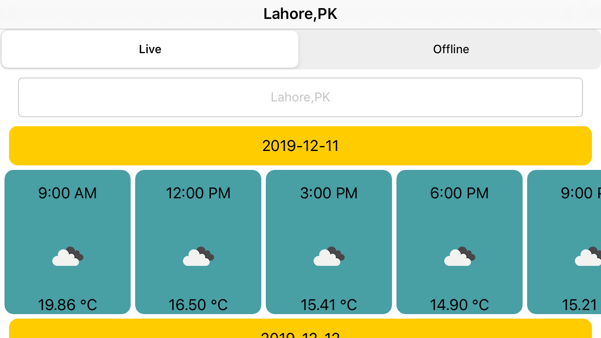

# Weather
App Presents information in the view about the temperature, time, date and weather icon in a form of a list, where each row contains all forecasts for a certain day, scrollable of the screen to the right

### Features
- User can search for any city supported by openWeather API and an auto complete list is shown as they search for city and they can fetch wether by tapping on the desired city from the searched list.
- User can switch between live and offline tabs to view either live data or locally stored forcast data from bundled json file.
- While swithcing between tabs last live forcast result is persisted so that user can easily view the last live result by switching the tab and does not have to fetch data again and again.
- When app starts it loads the live forcast for deafult city.
- If there's no internet connectivity at the time of app start and no live forcast for Lahore is fetched. User is shown an error and when internet connectivity is restored app automatically detects the change.
- App supports both landscape and portrait orientations.
- App supports both light and dark mode.
- App supports iOS version 13.x and above. Tested on iPhone 8 with iOS version 13.1.3, and iPhone 11 Pro  simulator.

## Notes
- A cities.json file is bundled with the app, It contains list of all the cities supported by open weather API and is used for auto complete and forcast fetching. Users can only search for the cities in this file and there are over 200,000 cities in the file. 
- cities.json file size is around 20 MB and can be reduced by removing the coordinates for the cities as these are not being used. I used it for fetching the forcast by city id as recommended  in open weather API documentation, becuase of its sheer size the app takes a few seconds to load on first launch when this file is being loaded. This can be fixed by saving this file into coreData or realm offline database  and then making queries through that in auto complete. Other option is to shift to a service like Google places instead of bundling this cities.json file and use name search for city instead  of id search. But to save time I chose to bundle the json file.

## Sample Screens

## Getting Started

These instructions will get you a copy of the project up and running on your local machine for development and debugging purposes.

### Prerequisites

You would need a macbook with XCode 11.x installed. I built the app with XCode 11.2.1

### Installing Builds

- To be able to install the build on the iPhone you will be needing Apple Developer provisioning and certifcate. You can create your Apple developer account [here](https://developer.apple.com/).
- You can create build on iOS 13.x or later simulator provided with the XCode 11.x or later.
- To run the project Navigate to the *Weather* folder on your machine where you cloned it. And open the project using *Weather.xcodeproj* file.

## User Guide to use the app
- On Launch if app is connected to the internet it automatically fetches forcast for deafult city.
- Default view when app starts is the Live weather mode.
- User can move to offline mode by using the segment control at the top.
- Offline view shows the forcast for Belrin from the json file bundled with in the app.

## Technical Details

### Third Party
- No third party library is used.

### App Architecture
- MVVM Architecture is used in the app.
- Network layer is based on protocol oriented design.

### Code Structure
Code is divided into following Groups
- AppDeleagte  group contains the xcode auto generated AppDelegate and SceneDelegate classes.
- Constants group contains  Constant file which stores all the constants used across the app.
- Utlities contains AlertService protocol, Utility struct, Extension, DataModelDecoder. This code is reusable generic code used through out the app.
- Networking group contains all the files related to network layer. It contains sub groups of Reachability, NetworkHandler, NetworkRouting, HTTPHandlers, EndPoints and Services.
- Offline group contains bundled cities.json, lahore.json, JsonReader protocol and a sub group Service which contains OfflineWeatherService and  OfflineCityService for fetching offline data from json files.
- Models group contains the *ForcastResult*,*Forcast*,*WeatherParticular*,*Weather*,*City* models being used in the app.
- Constants group contains all the constants being used across the app.
- Source group contains the modules with their respetive view, view controllers, collection cells, collection headers and view models. Source group contains further subgroups named WeatherHome, AutoComplete, Binder.
- Home subgroup contains *WeatherViewController* and *WeatherViewModel*  for main forcast view. *WeatherCollectionCell*, *WeatherCollectionCellViewModel* and *DateHeaderCollectionReusableView* for displaying date wise weather forcast.
- Binder subgroup contains Bindable swift class. Its a generic type which provides a closure to be bind on the value so that events can be triggered on value change.

### Unit Tests
- Unit test are written and provide a code coverage of 74.6 percent. see the screenshot attached.

Unit tests are arranged in two subgroups:
- ViewModel subgroup contains tests written on ViewModels
- Networking subgroup contains tests written on Network Services
- Offline subgroup contains tests written on Offline Services

Following test cases are written:
- Weather Service test for checking if forcast is fetched correctly.
- Image Service test for checking if weather icon image is fetched correctly.
- WeatherViewModel for testing MapViewModel with mock lahore.json file to make sure view model behaves correctly.
- AutoCompleteViewModelTest for testing AutoCompleteViewModel to make sure view model behaves correctly.
- Url encoding test for URLEncoder to see if urls are being configured correctly.

### UI Tests
- Have recorded  one UI test where it checks for offline weather title when offline segment is tapped.

## Built With
- XCode 11.2.1
- Tested on iPhone 8. (iOS 13.1.3)

## Authors

- **Arslan Faisal** - (https://github.com/arslanFaisal)

## License

This project is licensed under the MIT License - see the [LICENSE.md](LICENSE.md) file for details

